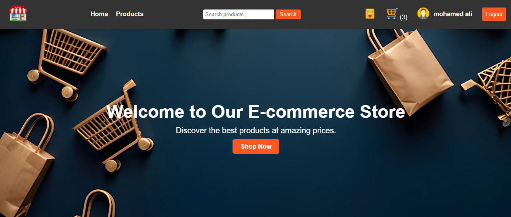

# ITI E-commerce Platform

An advanced E-commerce platform supporting four user roles: Admin, Customer, Seller, and Anonymous User. Built with HTML, CSS, JavaScript (ES5/ES6+), and `json-server` as the backend.

---



## Features

### **Admin**
- **User Management**:
  - Add, edit, delete, or archive users.
  - Approve or reject seller registrations.
- **Product Management**:
  - Approve, edit, or archive products.
- **Order Management**:
  - View, approve, or reject orders.
- **Reports**:
  - Generate user, product, and order reports.

### **Customer**
- Browse and search products.
- Add products to the cart and wishlist.
- View order history and track orders.
- Leave reviews and ratings.

### **Seller**
- Manage product inventory (add, edit, delete).
- View and manage customer orders.
- Approve or reject orders.

### **Anonymous User**
- Browse products with limited access.
- Register to unlock full features.

---

## Technologies Used

- **Frontend**: HTML, CSS, JavaScript (ES5, ES6+)
- **Backend**: `json-server` for simulating a REST API
- **Version Control**: Git and GitHub

---

## Installation and Setup

1. Clone the repository:
   ```bash
   git clone https://github.com/your-username/E-commerce-Platform.git
   cd E-commerce-Platform
   ```
2. Run `json-server` at port `3001`
     `json-server --watch .\dbjson\db.json --port 3001`
